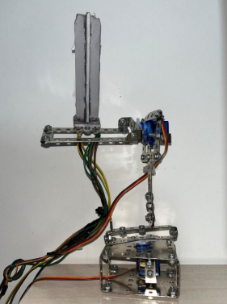
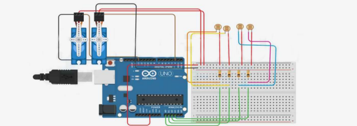
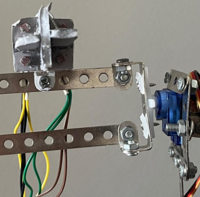
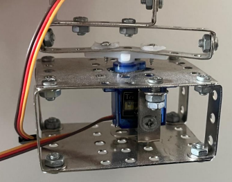
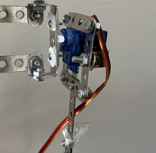

# ☀️ Dual-Axis Solar Tracker using Arduino

> A low-cost dual-axis solar tracking system developed using Arduino Uno, LDR sensors, and servo motors to maximize solar panel exposure to sunlight.

---

## 📖 Overview

Solar panels generate maximum power when they are perpendicular to sunlight. Since the sun's position changes continuously throughout the day, fixed solar panels cannot maintain optimal efficiency.

This project presents a **Dual-Axis Solar Tracker** that automatically aligns a photovoltaic panel toward the direction of maximum sunlight using four LDR sensors and two servo motors.

The project was developed as my Bachelor's Final Year Project in Electrical Engineering (Control Systems).

---

## ✨ Features

- Dual-axis solar tracking
- Automatic sunlight detection
- Closed-loop control
- Four LDR light sensors
- Two servo motors
- Low-cost implementation
- Simple and reliable control algorithm
- Easy to reproduce

---

# 🖼 Mechanical Structure

The complete mechanical structure of the dual-axis solar tracking system.

---

# ⚡ Circuit Diagram

The complete electronic circuit used for the project.

Main components:

- Arduino Uno
- Four LDR sensors
- Voltage Divider Network
- Two Servo Motors
- External Power Supply

---

# ☀️ LDR Sensor Configuration

Four Light Dependent Resistors (LDRs) are arranged around a separator to detect the direction of maximum light intensity.

The controller continuously compares:

- Left vs Right
- Top vs Bottom

and rotates the solar panel until the light difference becomes minimal.

---

# ↔ Horizontal Servo Motor

The horizontal servo controls the **Azimuth Axis**, allowing the panel to rotate from east to west.

---

# ↕ Vertical Servo Motor

The vertical servo controls the **Elevation Axis**, adjusting the panel angle according to the sun's height.

---

# ⚙️ Control Algorithm

The controller performs the following steps continuously:

1. Read all four LDR sensors.
2. Calculate horizontal light error.
3. Calculate vertical light error.
4. Compare the measured values with a predefined threshold.
5. Rotate the corresponding servo motor.
6. Repeat until both errors become negligible.

This lightweight control strategy provides stable tracking while keeping the implementation simple and inexpensive.

---

# 🛠 Hardware

| Component | Description |
|-----------|-------------|
| Microcontroller | Arduino Uno (ATmega328P) |
| Sensors | 4 × LDR |
| Actuators | 2 × Servo Motors |
| Power | External DC Supply |
| Panel | Mini Solar Panel |

---

# 💻 Software

- Arduino IDE
- Servo Library

---

# 🚀 Future Improvements

- MPPT Integration
- PCB Design
- RTC-based Sun Position Initialization
- Astronomical Tracking Algorithm
- IoT Monitoring
- Wireless Control
- Weather Compensation

---

# 🎓 Academic Project

This project was developed as the Bachelor's Final Year Project for the Electrical Engineering (Control Systems) program.

---

# 👨‍💻 Author

**Ali Vafaeipour**

Electrical Engineering – Control Systems

Interested in:

- Embedded Systems
- Control Engineering
- PCB Design
- Power Electronics
- Renewable Energy

---

# 📄 License

This project is licensed under the MIT License.
